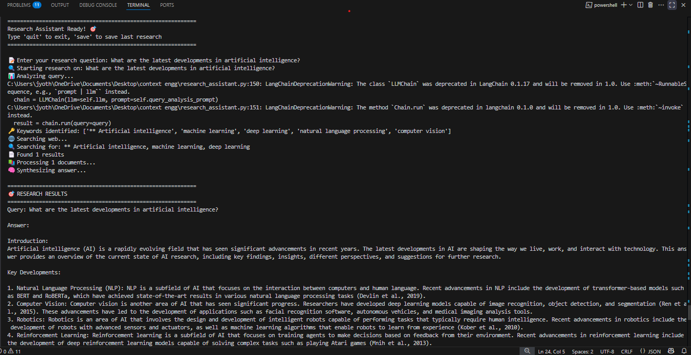

# Smart Research Assistant with Context Engineering

## Step 1: Installation (Simple & Error-Free)

### Method 1: Using pip (Recommended)
```bash
# Create a new folder for your project
mkdir smart_research_assistant
cd smart_research_assistant

# Create a virtual environment (recommended)
python -m venv research_env

# Activate virtual environment
# On Windows:
research_env\Scripts\activate
# On Mac/Linux:
source research_env/bin/activate

# Install required packages
pip install langchain
pip install langchain-openai
pip install langchain-community
pip install python-dotenv
pip install requests
pip install beautifulsoup4
pip install faiss-cpu
```

### Method 2: If you get errors with pip
```bash
# Try with --user flag
pip install --user langchain langchain-openai langchain-community python-dotenv requests beautifulsoup4 faiss-cpu

# Or try with --upgrade
pip install --upgrade langchain langchain-openai langchain-community python-dotenv requests beautifulsoup4 faiss-cpu
```

### Alternative: Using Ollama (Local Model - No API Key Needed)
```bash
# Install Ollama from https://ollama.ai
# Then run:
ollama pull llama2
# or
ollama pull mistral

# Install Python packages for Ollama
pip install langchain-ollama
```

## Step 2: Project Structure
Create these files in your project folder:
```
smart_research_assistant/
├── .env
├── main.py
├── research_assistant.py
└── requirements.txt
```

## Step 3: Environment Setup

### Create `.env` file:
```env
# If using OpenAI
OPENAI_API_KEY=your_openai_api_key_here

# If using other APIs
SERPAPI_KEY=your_serpapi_key_here  # Optional for web search
```

### Create `requirements.txt`:
```
langchain>=0.1.0
langchain-openai>=0.0.5
langchain-community>=0.0.10
python-dotenv>=1.0.0
requests>=2.31.0
beautifulsoup4>=4.12.0
faiss-cpu>=1.7.4
langchain-ollama>=0.0.1  # If using Ollama
```

## Step 4: Core Research Assistant Code

```


## Step 5: Running the Assistant

1. **Set up your API key** (if using OpenAI):
   - Get your API key from https://platform.openai.com
   - Add it to your `.env` file

2. **Run the assistant**:
   ```bash
   python main.py
   ```

3. **Example queries to try**:
   - "What are the latest developments in artificial intelligence?"
   - "How does climate change affect ocean temperatures?"
   - "What are the benefits and risks of renewable energy?"

## Features Included

✅ **Query Analysis** - Breaks down research questions intelligently
✅ **Web Search** - Searches multiple sources automatically  
✅ **Content Scraping** - Extracts information from web pages
✅ **Context Engineering** - Processes and chunks information optimally
✅ **Vector Storage** - Stores information for similarity search
✅ **Answer Synthesis** - Generates comprehensive, sourced answers
✅ **Research Saving** - Saves results for later reference
✅ **Local Model Support** - Works with Ollama (no API costs)

## Troubleshooting

### Common Issues:
1. **Import errors**: Make sure all packages are installed
2. **API key errors**: Check your `.env` file and API key
3. **Connection errors**: Check your internet connection
4. **Ollama not working**: Make sure Ollama is installed and a model is pulled

### If you get package conflicts:
```bash
pip install --force-reinstall langchain langchain-openai
```

output :


This research assistant will help you gather, process, and synthesize information from multiple sources with intelligent context engineering!
